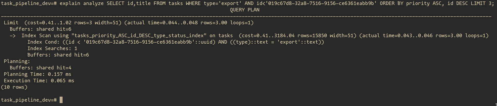
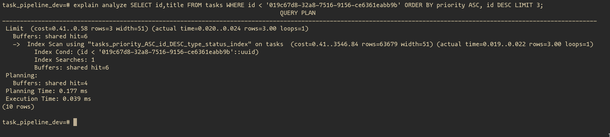
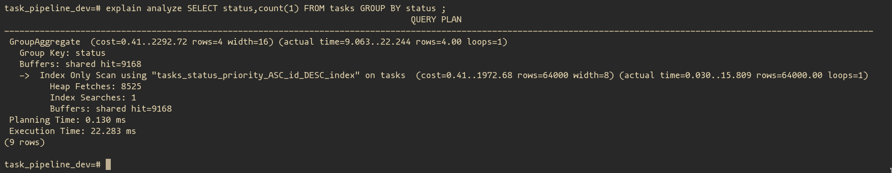
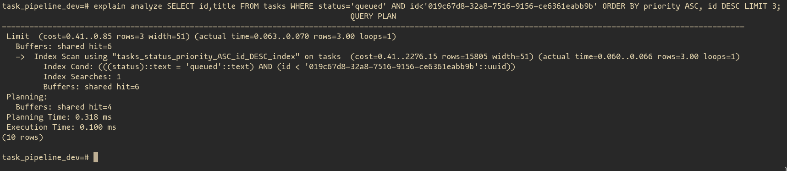

# Core requirements

Decisions are made based on [mind map](notes_assets/TaskProcessingPipeline.png) created from task requirements.

## Task data model

Schema-related decisions:
- Using UUIDv7 as an `id` field. It includes timestamp at the beginning, so you can sort by `id` and get meaningful results.
- Model `priority` field as integer-based enum. It allows meaningful sorting, as well, and can be used for `priority` in Oban jobs. Remaining enums are string-based
- Added `version` field for optimistic locking to ensure proper concurrency. In case of race conditions, only one process will be able to update a record. Other will get an error. This way, we can control concurrency for changes without explicit locks (this is faster).

Index decisions:
- Primary key index was created by default.
- Index `["priority ASC", "id DESC", :type, :status]` covers many cases for `GET /api/tasks` endpoint. It allows to filter by `priority`, `priority and type`, `priority and type and status`. Also it supports ordering by priority (critical first) and creation time (newest first). As `id` field (UUIDv7) has a timestamp - it can be efficiently used to represent creation time, as well as to filter older items for cursor - based pagination. Of course, the timestamp in `id` may differ from the one in `created_at` field, and thus result in wrong order of some tasks (according to `created_at` field) - this is a conscious trade-off which allows to reduce resource usage.

- Index `[:status, "priority ASC", "id DESC"]` cover filter by `status` or `priority and status` cases for `GET /api/tasks` endpoint. It also supports correct sorting by priority and creation time, but uses the same tradeoff, as a previous index. Also this index fully supports `GET /api/tasks/summary` endpoint and allows index-only scan for counting metrics. This allows to get results faster, and to, some extent to reduce a need in caching.

